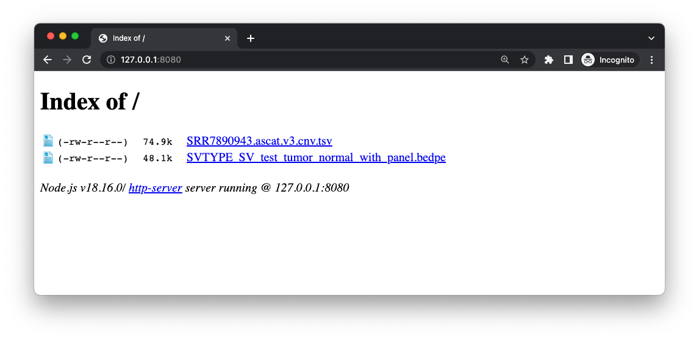
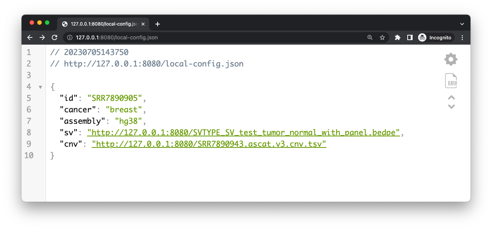
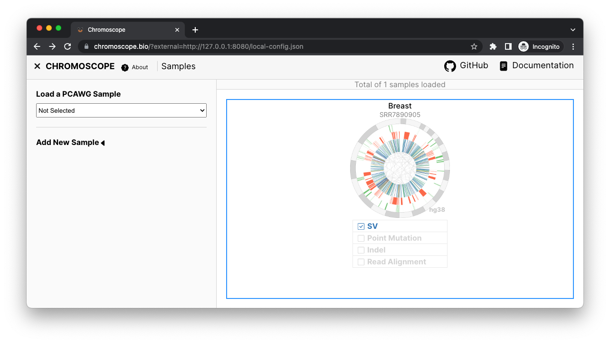
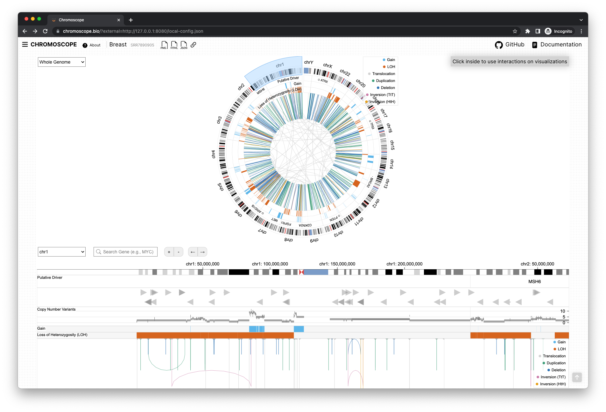

# Loading Local Data

:::tip
You may also want to see the [Chromoscope Python package](./python-package), which allows you to load local files on computational notebooks.
:::

You can run a local file server to display local files on Chromoscope. This enables you to safely visualize your private files. There are multiple light and easy-to-install file servers. In this page, we will use [http-server](https://www.npmjs.com/package/http-server) for the demonstration.

## Run Local File Server

You first need to install the file server called [http-server](https://www.npmjs.com/package/http-server). To install it, you need to first install a package manager, [npm](https://docs.npmjs.com/downloading-and-installing-node-js-and-npm#using-a-node-installer-to-install-node-js-and-npm). 

:::tip
To install npm, please refer to the official documentation: https://docs.npmjs.com/downloading-and-installing-node-js-and-npm#using-a-node-installer-to-install-node-js-and-npm
:::

After installing the [npm](https://docs.npmjs.com/downloading-and-installing-node-js-and-npm#using-a-node-installer-to-install-node-js-and-npm), you can use it to install [http-server](https://www.npmjs.com/package/http-server). For example, run the following command on your terminal.

```sh
npm install http-server -g
```

Now you can run the server on the designated folder.

```sh
http-server ./path-to-your-folder --cors -c-1
```

Note that the `--cors` option allows the browser to access your files.

Now, you can browse files that are located under the selected folder using your browser. For example, open [http://127.0.0.1:8080/](http://127.0.0.1:8080/) on the browser.



:::info
Also see https://stackoverflow.com/a/16350826
:::

## Create Data Config

Using the URL of the local files, you can make a [data config](./through-data-config). For example, the following example specify two local files (i.e., SV and CNV).

```json
{
	"id": "SRR7890905",
    "cancer": "breast",
    "assembly": "hg38",
    "sv":  "http://127.0.0.1:8080/SVTYPE_SV_test_tumor_normal_with_panel.bedpe",
	"cnv": "http://127.0.0.1:8080/SRR7890943.ascat.v3.cnv.tsv"
}
```

:::tip
You can download the following files to test this.

- SV: https://somatic-browser-test.s3.amazonaws.com/SVTYPE_SV_test_tumor_normal_with_panel.bedpe
- CNV: https://gist.githubusercontent.com/sehilyi/6fbceae35756b13472332d6b81b10803/raw/596428a8b0ebc00e7f8cbc52b050db0fbd6e19a5/SRR7890943.ascat.v3.cnv.tsv
:::

## Use Local Data Config

You can also put this local data config (say, `local-config.json`) under the folder hosted by your [http-server](https://www.npmjs.com/package/http-server). You should be able to open the data config file on the browser using [http://127.0.0.1:8080/local-config.json](http://127.0.0.1:8080/local-config.json).


If you open the following URL, you should be able to open the data config on your browser.

```sh
http://127.0.0.1:8080/local-config.json
```




## Open Browser

As a last step, use the data config you created to browse your local files in Chromoscope.

```
https://chromoscope.bio/?external=http://127.0.0.1:8080/local-config.json
```



